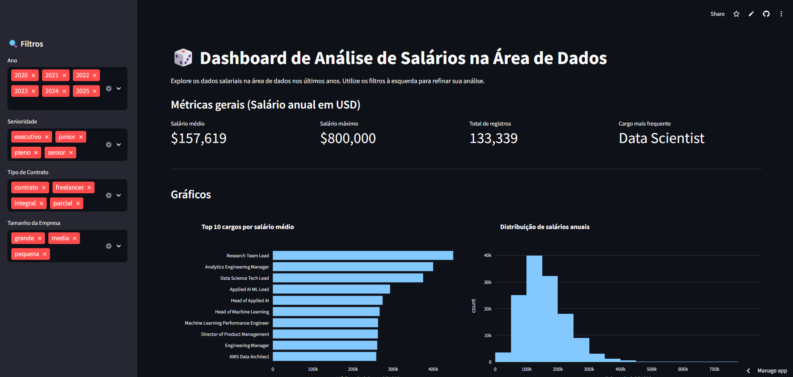
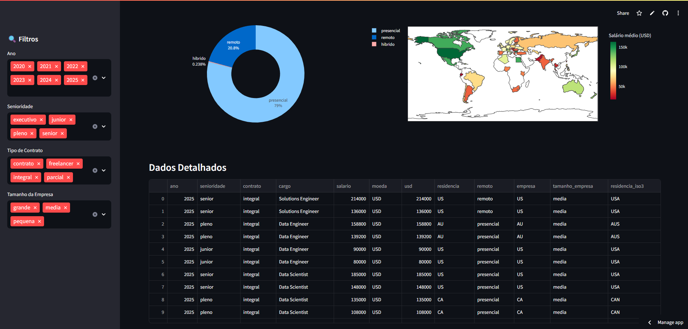

# 📊 Imersão Dados Python: Análise de Salários em Tech

[](https://imersao-dados-python-thiago.streamlit.app/)
[](https://colab.research.google.com/drive/1abyg8L_XIJ5-BGHU4R3b_8IFcIAdb8JA?usp=sharing)


Este projeto foi desenvolvido durante a **Imersão Dados Python**, focando na exploração e visualização de dados sobre o mercado de trabalho em tecnologia.

## 🚀 O Projeto

O foco principal é a análise de tendências salariais baseada em diversos fatores:
- **Senioridade:** Junior, Pleno, Sênior e Lead.
- **Modalidade de Trabalho:** Remoto, Presencial ou Híbrido.
- **Geografia:** O impacto da localização na remuneração.

### 🔗 Links do Projeto
- **Dashboard Interativo:** [Acesse aqui](https://imersao-dados-python-thiago.streamlit.app/)
- **Notebook de Análise:** [Google Colab](https://colab.research.google.com/drive/1abyg8L_XIJ5-BGHU4R3b_8IFcIAdb8JA?usp=sharing)

---

## 🛠️ Tecnologias Utilizadas

* **Python**: Linguagem base.
* **Pandas**: Manipulação de dados.
* **Plotly/Seaborn**: Visualizações gráficas.
* **Streamlit**: Interface do Dashboard.

---

## ⚙️ Como executar localmente

1. Clone o repositório:
   ```bash
   git clone [https://github.com/thiagoan19/imersao-dados-python.git](https://github.com/thiagoan19/imersao-dados-python.git)

## 📷 Visualização do Dashboard

### Visão Geral


### Análise por Localidade e Senioridade

